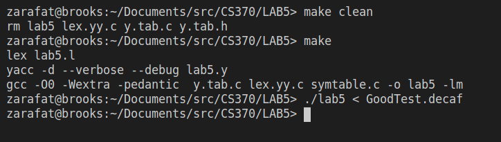
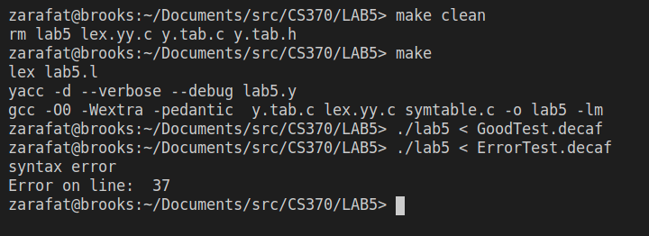

# CS370 Compilers Lab 5
## Ziad Arafat - Mar 8 2021

In this lab we take our previous lab code and implement the proper syntax rules from the DECAF programming language. 

## Screenshots
#### Good Test

#### Error Test

## Changelog

#### LEX
- added the DECAF tokens
- Added some debug prints to the tokens
- Added square brackets to the lex directive
- Added '<' token to the directive
- Added modulus '%'
- Added directive for HEX numbers
- Created function to convert hex numbers to their int value
- Disabled the newline return token

#### YACC
- added all the rules from DECAF and reformatted them to work with Bison */
- for each of the rules with a list of tokens I created a recursive rule that allows for one or more of the token. 
- Replaced any instance of '=' with T_ASSIGN 