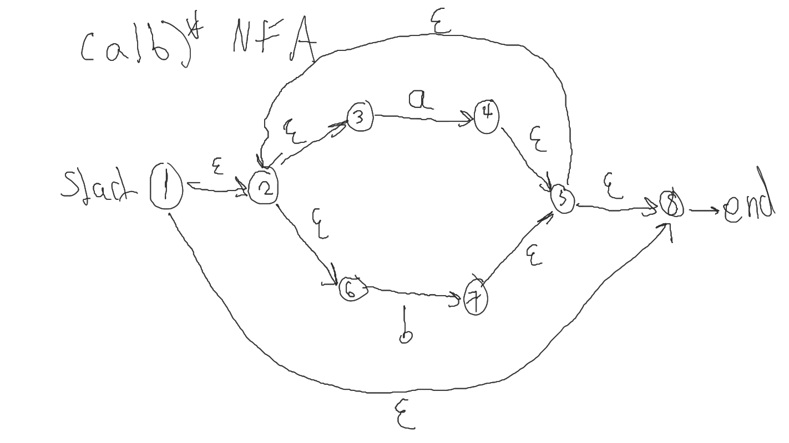
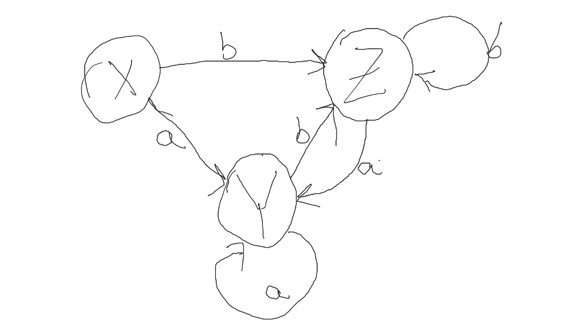

# Chapter 3 Homework
## Ziad Arafat, Feb 20 2021

### 3.6.3

- There's a lot of paths that follow aabb so I assume we don't have to literally list all of them. 
- Here's the aabb path that goes to the end. 
$$ 0 \Rightarrow (a) 1 \Rightarrow (a) 2 \Rightarrow (b) 2 \Rightarrow (b) 3$$

### 3.6.4
- Accepted
$$0 \Rightarrow(a) 1 \Rightarrow (\epsilon) 0 \Rightarrow (a) 1 \Rightarrow (b) 2 \Rightarrow (b) 3$$

$$0 \Rightarrow (\epsilon) 3 \Rightarrow (a) 0 \Rightarrow (a) 1 \Rightarrow (b)  2 \Rightarrow (b) 3$$

$$0 \Rightarrow (\epsilon) 3 \Rightarrow (\epsilon) 2 \Rightarrow (\epsilon) 1 \Rightarrow (\epsilon) 0 \Rightarrow (a) 1 \Rightarrow (\epsilon) 0 \Rightarrow (a) 1 \Rightarrow (b) 2 \Rightarrow (b) 3$$ 

### 3.6.5

#### a
| State     | a       | b         | a + $\epsilon$ | b + $\epsilon$ |
|-----------|---------|-----------|----------------|----------------|
| {0}       | {1,0}   | {0}       | {1,0}          | {0}            |
| {1,0}     | {1,0,2} | {0,1}     | {1,0,2}        | {0,1}          |
| {1,0,2}   | {1,0,2} | {0,1,2,3} | {1,0,2}        | {0,1,2,3}      |
| {0,1,2,3} | {1,0,2} | {0,1,2,3} | {1,0,2}        | {0,1,2,3}      |

#### b
| State     | a     | b     | a + $\epsilon$ | b + $\epsilon$ |
|-----------|-------|-------|----------------|----------------|
| {0,1,2,3} | {0,1} | {2,3} | {0,1,2,3}      | {0,1,2,3}      |

### 3.7.3
#### a

##### NFA $(a|b)*$

##### Transition Table

| State          | a   | b   | a + $\epsilon$    | b + $\epsilon$    |
|----------------|-----|-----|-------------------|-------------------|
| X: {1,2,3,6}   | {4} | {7} | {4,3,2,6,8}       | {7,3,2,6,8}       |
| Y: {4,3,2,6,8} | {4} | {7} | {4,3,2,6,8}       | {7,3,2,6,8}       |
| Z: {7,3,2,6,8} | {4} | {7} | {4,3,2,6,8}       | {7,3,2,6,8}       |

##### DFA

