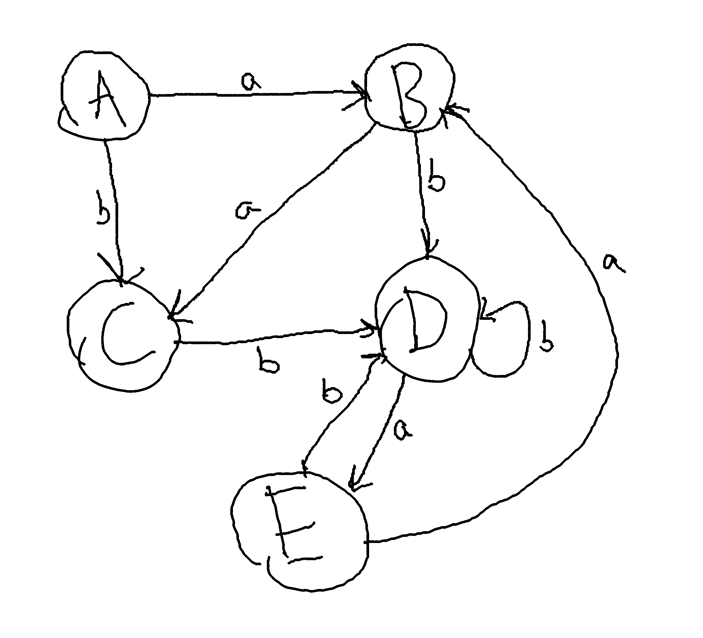

# Ziad Arafat

| State   | a     | b       | a + $\epsilon$ | b + $\epsilon$ |
|---------|-------|---------|----------------|----------------|
| A:{0}     | {1,2} | {1}     | {1,2,3}        | {1,3}          |
| B:{1,2,3} | {1}   | {3,4}   | {1,3}          | {3,4,2}        |
| C:{1,3}   | {}    | {3,4}   | {}             | {3,4,2}        |
| D:{3,4,2} | {0,1} | {4}     | {0,1,3}        | {4,2,3}        |
| E:{0,1,3} | {1,2} | {1,3,4} | {1,2,3}        | {3,4,2}        |

