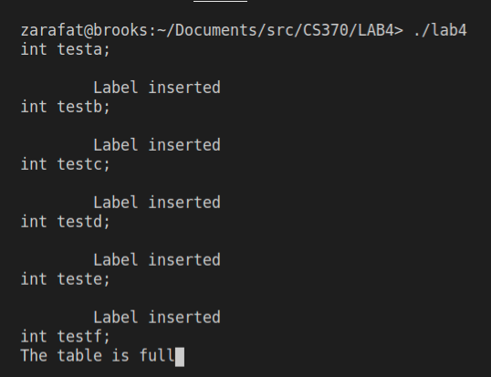
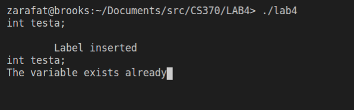
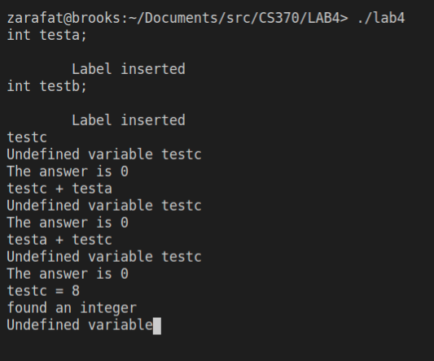
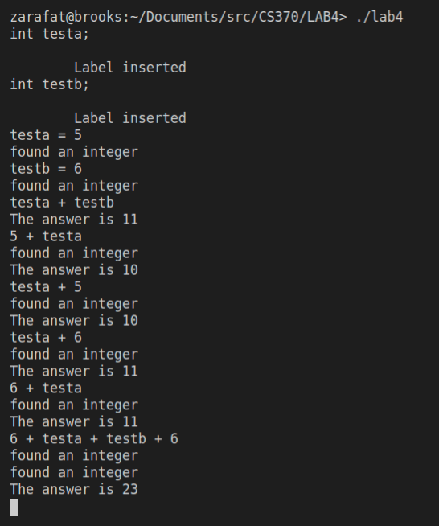

# CS 370 Compilers 
## Ziad Arafat - Feb 28 2021

### Overview
In this project we are combining and extending the symbol table utilities we built and the calculator we built in order to create basic data types and more sophisticated syntax.

### To run code

- to build run:

```bash
make
```

- to test the code with the testinput.txt file run:

```bash
make test
```

- to clean the generated files

```bash
make clean
```

### Screenshots

1. Symbol table is full



2. The variable already exists



3. The variable doesn't exist



4. Left and right assignment usage test

