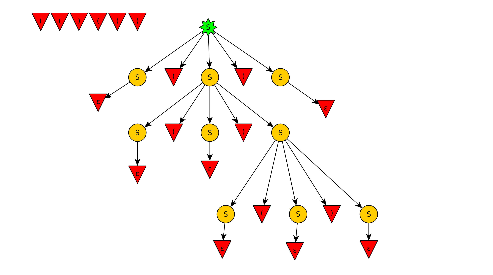
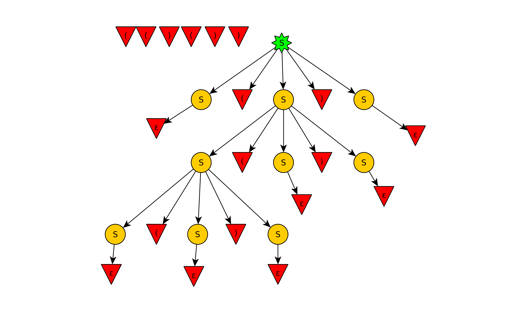

# HW 4a

## 4.2.2 c

$$S \Rightarrow S(S)S | \epsilon$$

### Left Most
$$S \Rightarrow S(S)S$$
$$ \epsilon(S)S$$
$$ \epsilon(S(S)S)S$$
$$ \epsilon(\epsilon(S)S)S$$
$$ \epsilon(\epsilon(\epsilon)S)S$$
$$ \epsilon(\epsilon(\epsilon)S(S)S)S$$
$$ \epsilon(\epsilon(\epsilon)\epsilon(S)S)S$$
$$ \epsilon(\epsilon(\epsilon)\epsilon(\epsilon)S)S$$
$$ \epsilon(\epsilon(\epsilon)\epsilon(\epsilon)\epsilon)S$$
$$ \epsilon(\epsilon(\epsilon)\epsilon(\epsilon)\epsilon)\epsilon$$

### Right Most

$$S \Rightarrow S(S)S$$
$$  S(S)\epsilon$$
$$  S(S(S)S)\epsilon$$
$$  S(S(S)\epsilon)\epsilon$$
$$  S(S(S)\epsilon)\epsilon$$
$$  S(S(\epsilon)\epsilon)\epsilon$$
$$  S(S(S)S(\epsilon)\epsilon)\epsilon$$
$$  S(S(S)\epsilon(\epsilon)\epsilon)\epsilon$$
$$  S(S(\epsilon)\epsilon(\epsilon)\epsilon)\epsilon$$
$$  S(\epsilon(\epsilon)\epsilon(\epsilon)\epsilon)\epsilon$$
$$  \epsilon(\epsilon(\epsilon)\epsilon(\epsilon)\epsilon)\epsilon$$

### Parse Trees

#### Here are two valid parse trees!

### Is the grammar ambiguous?
It is ambiguous because you can generate two different trees using left derivation (same for right derivation) on the same input string.

### Describe the language

All possible strings of balanced brackets (opening and closing.)

## 4.2.3 a

$$S \Rightarrow 01S | 1S | \epsilon$$

## 4.4.1 c
